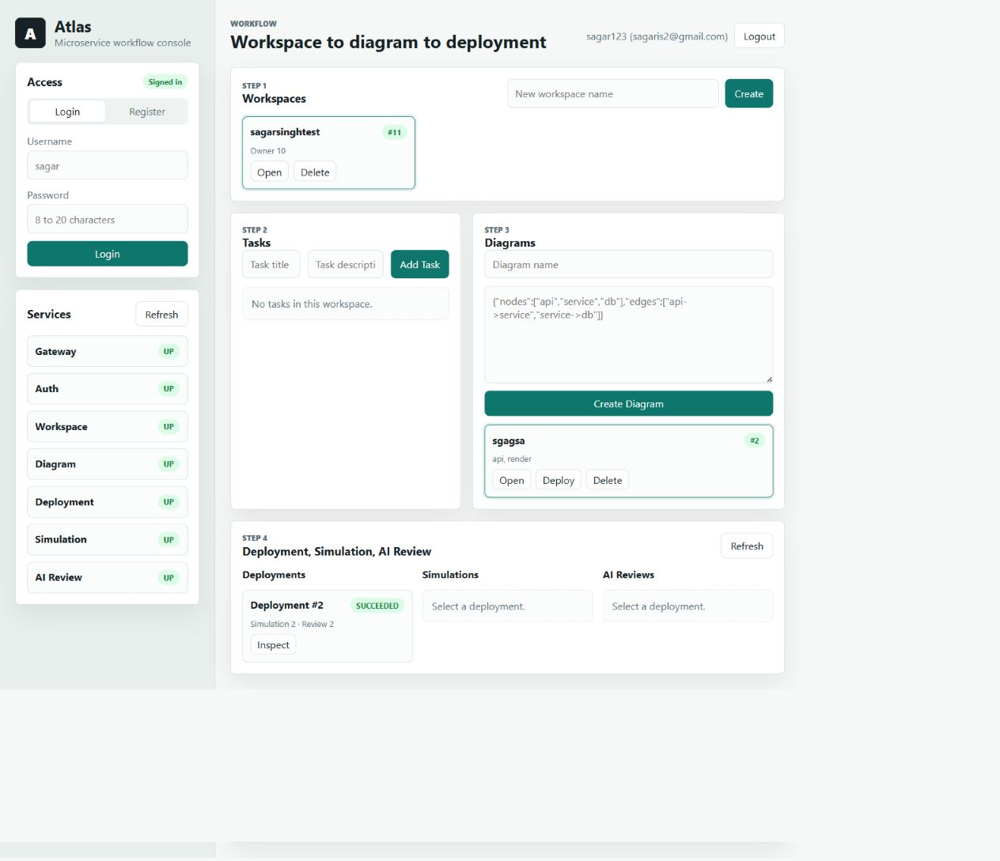

# Atlas

> **Testing note:** Atlas is a microservice application with multiple backing PostgreSQL databases. If you are a recruiter and want to test the project remotely, ask me to forward the required ports after running it, or run the project on their own local device with Docker and Java installed.



Atlas is a microservice workflow console for managing software delivery work from workspace planning through diagram creation, deployment simulation, and AI review. The application is built around independent Spring Boot services, each with its own database, and a single API gateway that serves the frontend and routes API requests to the right service.

## What Atlas Does

Atlas lets a user:

- Register and log in with JWT authentication.
- Create and manage workspaces.
- Add tasks inside a workspace.
- Create architecture or workflow diagrams for a workspace.
- Deploy a diagram through the deployment service.
- Process deployment, simulation, and AI review asynchronously through Kafka events.
- Protect gateway API traffic with Redis-backed rate limiting.
- Use a single frontend served by the API gateway.

## Architecture

The system is split into focused services:

- `api-gateway` on port `8079`: serves the frontend and proxies `/api/v1/**` requests.
- `auth-service` on port `8080`: handles registration, login, current user lookup, and JWTs.
- `workspace-service` on port `8081`: manages user workspaces.
- `task-service` on port `8082`: manages workspace tasks.
- `diagram-service` on port `8083`: manages diagrams and triggers deployment.
- `deployment-service` on port `8084`: creates deployments and coordinates simulation and review.
- `simulation-service` on port `8085`: records deployment simulation results.
- `ai-review-service` on port `8086`: records AI review summaries and scores.

Each service uses its own PostgreSQL container so the project behaves like a real microservice system rather than a single shared database app. Kafka connects the deployment pipeline asynchronously, and Redis stores shared gateway rate-limit counters.

## Async Deployment Flow

Atlas uses Kafka for the deploy -> simulate -> review workflow:

1. A diagram deployment request creates a deployment with `PENDING` status.
2. Deployment Service publishes `atlas.deployment.requested.v1` after the database commit.
3. Simulation Service consumes the event, records a simulation, and publishes `atlas.simulation.completed.v1`.
4. AI Review Service consumes the simulation event, records a deterministic review, and publishes `atlas.review.completed.v1`.
5. Deployment Service consumes the review event and marks the deployment `SUCCEEDED`.

Simulation and review records are idempotent by deployment ID, so repeated Kafka deliveries do not intentionally create duplicate processing rows.

## Local Setup

Prerequisites:

- Java 26 or compatible local JDK
- Maven
- Docker Desktop

Create your local environment file:

```bash
cp .env.example .env
```

Update `.env` with local passwords and a strong JWT secret. Do not commit `.env`.

Start the databases:

```bash
docker compose up -d
```

Run the services from separate terminals:

```bash
mvn -s .mvn/local-settings.xml -pl services/auth-service spring-boot:run
mvn -s .mvn/local-settings.xml -pl services/workspace-service spring-boot:run
mvn -s .mvn/local-settings.xml -pl services/task-service spring-boot:run
mvn -s .mvn/local-settings.xml -pl services/diagram-service spring-boot:run
mvn -s .mvn/local-settings.xml -pl services/deployment-service spring-boot:run
mvn -s .mvn/local-settings.xml -pl services/simulation-service spring-boot:run
mvn -s .mvn/local-settings.xml -pl services/ai-review-service spring-boot:run
mvn -s .mvn/local-settings.xml -pl services/api-gateway spring-boot:run
```

Open the app:

```text
http://localhost:8079/
```

## Deployment Notes

For deployment, expose only the API gateway publicly. Keep service ports and PostgreSQL ports private to the host or internal network.

Recommended public entrypoint:

```text
https://your-domain.com -> api-gateway:8079
```

Keep production secrets outside GitHub:

- `.env`
- database passwords
- JWT secret
- deployment-specific service URLs

Use `.env.example` only as a template with placeholder values.
